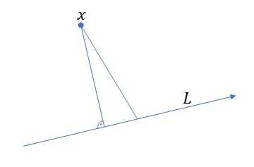
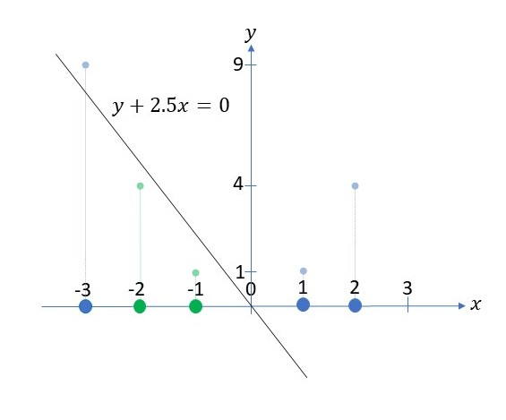
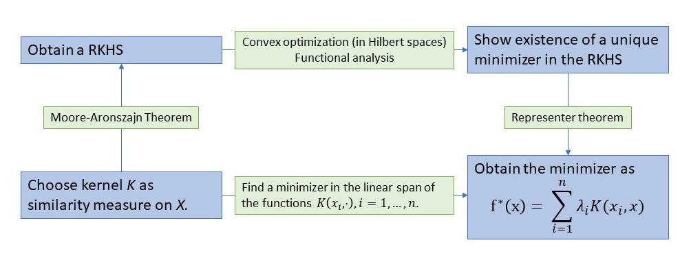

Ich bin das erste mal mit der Theorie maschinellen Lernens in einer Mastervorlesung über Pattern Recognition im Rahmen meines Informatik Nebensfachs gekommen.\
Das Gebiet beschäftigt sich mit der Entwicklung von Prozessen und Algorithmen, welche Computer befähigen, Aufgaben durch Erfahrung zu erlernen, gesteuert durch ein Performance-Maß. Insbesondere ist die erlernte Durchführung der Aufgabe nicht hartkodiert. In der Tat is es für komplexe Modelle wie tiefe neuronale Netze schwierig, Gesetztmäßigkeiten nachzuvollziehen, nach welchen dieses handelt.

Mittlerweile haben meiner Einschätzung nach die meisten Akademiker gewisse Berührpunkte mit maschinellen Lernen gemacht aufgrund des breiten Anwendungsspektrums maschineller Lernalgorithmen und deren große Erfolge, z.B. bei der Erkennung Kreditkartenbetrugs in Kontoauszügen, oder der Erkennung von Tumoren in Gehirnscans.\
Selbst in der numerischen Analysis partieller Differentialgleichungen etablieren sich allmählich Algorithmen maschinellen Lernens. Insbesondere in den Geowissenschaften, in welchen große Mengen an Daten aufgezeichnet werden, erfolgt die Simulation von Modellen nicht mehr nur auf Basis der numerischen Berechnung der involiverten Gleichungen der Physik, sondern wird in der Regel kombiniert mit datengetriebenen Ansätzen. Ich konnte darüber dankbarerweise zwei spannende Vorträge im Rahmen des Mathematischen Kolloquiums an der Universität Ulm von [Prof. Dr. Jakob Runge](https://www.uni-ulm.de/fileadmin/website_uni_ulm/mawi.inst.010/Abstract_Jakob_Runge.pdf) und [Prof. Dr. Gitta Kutyniok](https://www.uni-ulm.de/fileadmin/website_uni_ulm/mawi.inst.010/Abstract_Kutyniok.pdf) besuchen, welche Experten in diesem Gebiet sind.

Mittlerweile stehen eine Vielzahl an Büchern und anderen Ressourcen zur Verfügung, mit deren Hilfe und einem grundlegenden Verständnis von Statistik und Programmierung, man viele Methoden maschinellen Lernens erlernen kann. In jüngerer Zeit habe ich mich hier insbesondere mit [Hands-On Machine Learning with Scikit-Learn, Keras, and TensorFlow](https://learning.oreilly.com/library/view/hands-on-machine-learning/9781098125967/) von Aurélien Géron auseinandergesetzt, welches ich als sehr zugänglich empfinde. 

Legt man die Faszination der Anwendungen für einen Moment auf die Seite, bleibt nach wie vor eine recht tiefe und interessante Theorie, welche vielen Methoden zugrundeliegt. Ein Beispiel, welchem ich kürzlich begegnet bin, ist das der Reproducing Kernel Hilbert Spaces (RKHS), welches ich gerne als Beispiel hier etwas illustrieren möchte.\
Der nette Aspekt der Theorie ist, dass die Theorie der RKHS nicht nur erklärt, warum Methoden wie Ridge Regression funkionieren und sinnvoll sind, sie erklärt auch, warum Anwender die tiefe Theorie nicht einmal verstehen müssen, da sie rein im Hintergrund abläuft.

RKHS spielen eine Rolle für gewisse Regressions- und Klassifizierungsprobleme. Nehmen wir an, wir haben Input-Daten die in einer Menge $X$ enthalten sind. Dabei kann $X$ eine Menge von Textdateien sein, numerische Werte enthalten, Bilder etc. oder Kombinationen von diesen. Bei Klassifizierungsproblemen nehmen wir an, dass jedes Element in $X$ eine *wahre* Klasse hat, z.B. wenn $X$ eine Menge von Katzen- und Hundebildern ist und jedes Bild einer der beiden Klasse angehört: Katze oder Hund.\
Bei Regressionsproblemen wird angenommen, dass jedes Element in $X$ einen *wahren* oder *akkuraten* Werte hat, wie z.B. der Wert eines Hauses, wobei $X$ Daten von Häusern bzw. Immobilien in einer Region enhält.\
Diese Klassen oder wahren Werte nennt man in der Regel label.

Angenommen wir haben Daten $x_1, ... , x_n \in X$ für $n \in \mathbb{N}$ deren labels $y_1, ... , y_n \in \mathbb{R}$ wir kennen. Dann nennen wir $(x_1,y_1),...,(x_n,y_n)$ unsere Trainingsdaten.

Wir möchten dann relativ präzise den Preis eines jeden Hauses mit Daten mit den Eigenschaften $x \in X$ bestimmen. Wir beschreiben dies über eine Funktion $f\colon X \to \mathbb{R}$ und hoffen, dass durch Wahl einer Funktion $f$, welche die Trainingsdaten gut approximiert, wir mittels $f$ auch relativ präzise die label neuer, nicht in den Trainingsdaten enthaltener Input-Daten bestimmen können (das Overfitting-Problem spreche ich in einem Moment an).\
Wir messen die Präzision in der Trainingsphase durch Wahl eines Performance-Maßes $V\colon X \times \mathbb{R} \to [0,\infty)$, wobei $V(f(x_i),y_i)$ klein sein sollte, wenn $f(x_i) \sim y_i$ und groß, wenn $f(x_i)$ und $y_i$ stark voneinander abweichen. Eine Standardbeispiel eines Performance-Maßes ist die quadratische Distanz
$$ V(f(x_i),y_i) = |f(x_i) - y_i|^2.$$
Betrachten wir das Mittel über den Trainingsdaten, bekommen erhalten wir eine sogenannte Verlustfunktion (engl. loss function) für unsere Regressionsfunktion $f\colon X \to \mathbb{R}$:
$$ L(f) = \frac{1}{n}\sum_{i=1}^n V(f(x_i),y_i). $$

Es gibt viele Möglichkeiten in der präzisen Wahl eines Performance-Maßes und der Verlustfunktion. Eine wichtige Eigenschaft, welche diese üblicherweise gemeinsam haben, ist die der (strikten) Konvexität, welche unter weiteren Annahmen zumindest in der Theorie die mathematische Existenz eines eindeutigen Minimums und die Konvergenz von Approximationsverfahren gegen dieses Minimum garantiert.  

In der Regel, durch eine vorläufige Untersuchung der zur Verfügung stehenden Trainingsdaten, hat man bereits a priori eine Vorstellung davon, wie einfach oder komplex der Zusammenhang zwischen den Daten $x \in X$ und den zugehörigen label $y \in \mathbb{R}$ ist. Darauf basierend kann man eine Vorabauswahl eines oder mehrerer allgemeiner Modelle treffen, z.B. lineare oder polynomielle Modelle, neuronal Netze usw. Daher, anstelle alle Funktionen $f\colon X \to \mathbb{R}$ als mögliche Regressionsfunktionen zu betrachten, schränken wir uns auf eine gewisse Teilmenge von Funktion $H \subset \lbrace f\colon X \to \mathbb{R} \rbrace$ ein.
Das Regressionsproblem besteht dann darin, 
$$ f^* := \underset{f \in H}{\operatorname{argmin}} L(f) $$
zu bestimmen.

Minimierungsprobleme in Hilberträumen sind tendenziell sehr elegant lösbar. Warum? Hilberträume sind gewisse Vektorräume mit einem Skalarprodukt. Ein solches Skalarprodukt $\langle\cdot,\cdot\rangle_H$ gibt uns einen Begriff von Orthogonalität, welcher eng verbunden ist mit dem Problem zur Minimierung von Abständen.



Daher hätten wir gerne eine Hilbertraumstruktur für unsere Menge von Funktionen $H$. Diese Sichtweise ist relativ abstrakt, da wir Funktionen in $H$ ähnlich zu Punkten in der Ebene $\mathbb{R}^2$ auffassen, wo wir einen *natürlichen* Begriff von Orthogonalität haben. Dieser Ansatz ist aber fundamental in der [Funktionalanalysis](https://de.wikipedia.org/wiki/Funktionalanalysis), welche im letzten Jahrhundert sich zu einer der mächtigsten Theorien in der mathematischen Analysis entwickelt hat.

Allerdings entsteht nun die Frage, wie wir ein sinnvolles Konzept von Orthogonalität zwischen Funktionen in $H$ erhalten können. Dies ist in keiner Weise offensichtlich. Allerdings vereinfacht die Theorie der RKHS diese Frage signifikant in Form des [Moore-Aronszajn Theorems](https://en.wikipedia.org/wiki/Reproducing_kernel_Hilbert_space#Moore%E2%80%93Aronszajn_theorem):
Angenommen wir haben einen Kern $K\colon X \times X \to \mathbb{R}$, mit den Eigenschaften:
- Symmetrie: $K(z_1,z_2) = K(z_2,z_1)$ für alle $z_1,z_2 \in X$;
- Positive Semidefinitheit: Für alle $z_1,...z_k \in X$, $\lambda_1,...,\lambda_k \in \mathbb{R}$ gilt
$$ \sum_{i,j=1}^k \lambda_i\lambda_j K(z_i,z_j) \geq 0.$$
Dann gibt es einen eindeutigen Hilbertraum $H \subset \lbrace f \colon X \to \mathbb{R}\rbrace$, der *Reproducing Kernel Hilbert Space*, dessen reproduzierender Kern $K$ ist, das bedeutet, dass für alle $f \in H$ und $x \in X$,
$$ f(x) = \langle K(x,\cdot), f \rangle_H.$$

Daher erhält man bei Wahl eines Kerns mit diesen Eigenschaften automatisch (quasi im Hintergrund) einen bzw. den zugehörigen RKHS. Allerdings sollte erwähnt werden, dass noch die Wahl eines geeigneten Kerns getroffen werden muss.
Im allgemeinen sind Symmetrie und positive (Semi-)Definitheit Eigenschaften, welche ein Kern mit denen eines Skalarprodukts $ \langle \cdot, \cdot \rangle$ gemeinsam. Für ein Skalarprodukt beschreibt $\langle z_1,z_2 \rangle$ gerade die Länge von $z_1$, projiziert auf die Gerade welche von $z_2$ aufgespannt wird (sofern $z_2$ Länge 1 hat). Je näher also $z_1$ und $z_2$ in dieselbe Richtung zeigen, desto größer wird der Wert des Skalarprodukt. Man stellt sich daher im Allgemeinen den Kern $K(z_1,z_2)$ als eine Art Ähnlichkeitsmaß zwischen zwei Werten $z_1,z_2 \in X$ vor.   

Typische Beispiele, falls $X = \mathbb{R}^d$, sind z.B.
- der Gaussche Kern $K(z_1,z_2) = \exp\left( \frac{\|z_1-z_2\|^2}{\sigma^2} \right)$ für ein $\sigma^2 > 0$,
- oder polynomielle Kerne $K(z_1,z_2) = (z_1\cdot z_2+ 1)^l$ für $l \in \mathbb{N}$.

Falls $X$ nicht aus numerischen Daten in $\mathbb{R}^n$ (oder eines anderen Hilbertraumes besteht), kann man zunächst $X$ durch eine *feature map*  $\varphi\colon X \to Y$ transformieren. Ist $Y$ ein Hilbertraum mit Skalarprodukt $\langle \cdot, \cdot \rangle_Y$, dann ist ein Kern durch
$$ K(x,y) = \langle \varphi(x),\varphi(y) \rangle_Y$$
gegeben. Diese Methode zur Konstruktion von Kernen über feature maps wird häufig benutzt, um nicht-lineare Regression in einem Raum niedriger Dimension in ein lineares Regressionsproblem in einem höherdimensionalen umzuformulieren.

Wir diskutieren hier kurz diese Methode für Standardbeispiele quadratischer Regression. Angenommen unsere Daten $X \subset \mathbb{R}$ sind 1-dimensional und wir suchen nach einer quadratischen Regressionsfunktion
$$f \colon X \to \mathbb{R}, x \mapsto a x^2 + bx. $$
Mit Hilfe der der feature map $\varphi \colon \mathbb{R} \to \mathbb{R}^2, x \mapsto (x,x^2)$, verstecken wir das nicht-lineare Problem im Kern $K$, gegeben durch das Skalarprodukt auf $\mathbb{R}^2$ und der feature map $\varphi$, d.h.
$$K(z_1,z_2) = \langle \varphi(z_1),\varphi(z_2)\rangle_{\mathbb{R}^2} = \langle (z_1,z_1^2),(z_2,z_2^2)\rangle_{\mathbb{R}^2} = z_1z_2 + z_1^2z_2^2.$$
Der Ansatz über die feature map ist in sofern sinnvoll, da man sich überlegen kann, dass die quadratischen Funktionen auf $\mathbb{R}$ wie oben zu linearen Funktionen in $\mathbb{R}^2$ korrespondieren.\
Solche Beispiele fallen in die Kategorie von Methoden, welche typischerweise als *kernel trick* bezeichnet werden.\
Nachfolgend findet sich ein Beispiel eine 1-dimensionalen Menge $X = G \cup B$ aufgeteilt in die beiden Klassen
$$G = \lbrace -1, -2 \rbrace \text{ und } B = \lbrace -3, 1, 2\rbrace,$$
welche nicht linear, aber quadratischen separierbar sind in dem Sinne, dass für 
$y = f(x) = x^2+2.5x$, zum einen $G = \lbrace x \in X : f(x) < 0\rbrace$ und zum anderen $B = \lbrace x \in X : f(x) \geq 0\rbrace$ gilt.


Die feature map transformiert die Daten in $X$ in Punkte in der Ebene.



Dort sind die Daten linear separierbar, falls z.B.
$$\tilde{G} = \lbrace (-1,1), (-2,4) \rbrace \text{ and } \tilde{B} = \lbrace (-3,9), (1,1), (2,4)\rbrace,$$
und $\tilde{f}(x,y) = y+2.5x$, dann gilt $\tilde{G} = \lbrace (x,y) = \varphi(x) : x \in X \text{ and } \tilde{f}(x,y) < 0\rbrace$, while $\tilde{B} = \lbrace (x,y) = \varphi(x) : x \in X \text{ and } \tilde{f}(x,y) \geq 0\rbrace$.

Wir bemerken hier noch, dass wir $f$ sich auch als Linearkombination der Kernfunktionen $K(-3,\cdot), K(-2,\cdot), K(-1,\cdot), K(1,\cdot), K(2,\cdot)$, ausgewertet an den $x$-Werten der Trainingsdaten darstellen können:
$$f(x) = \frac{7}{4} K(1,x) - \frac{3}{4}K(-1,x).$$
Das ist kein bloßer Zufall und wird gleich etwas algemeiner beschrieben.

An dieser Stelle möchte ich auch noch einmal betonen, dass der Satz von Moore-Aronszajn auf keinen Fall trivial ist und ein Verständnis seines Beweises eine solide Basis in Funkionalanalysis erfordert.

Zurück zu unserem Regressionsproblem und dem RKHS $H$. Ein allgemein großes Problem besteht im Overfitting der Trainingsdaten, was passieren kann, wenn wir ein Modell aufstellen wollen, das sehr komplex ist relativ zu den eigentlichen Daten, welches dann zu sensitiv auf Rauschen reagiert.\
In unserer Situation eines RKHS kann dies durch *Tikhonov Regularisierung* unterdrückt werden. Das bedeutet, wir fügen unserer Verlustfunktionen einen Regularisierungsterm hinzu, sodass
$$ L(f) = \frac{1}{n}\sum_{i=1}^n V(f(x_i),y_i) + c \|f\|_H^2,$$
wobei $c > 0$ ein Regularisierungsparameter und $\|f\|_H = \sqrt{\langle f,f\rangle_H}$ die Norm von $f$ ist, welche durch das Skalarprodukt auf $H$ gegeben ist. Das ist in der Tat eine Regularisierung in dem Sinne, dass jedes $f \in H$ Lipschitz-stetig mit Lipschitz-Konstanten $\|f\|_H$ ist:
\begin{align*}
|f(z_1) - f(z_2)| = |\langle f,K(z_1,z_2)-K(z_1,z_2)\rangle| \leq  \|f\|_H d(z_1,z_2),
\end{align*}
wobei $d(z_1,z_2) := \|K(z_1,\cdot)-K(z_2,\cdot)\|_H$ als Distanz zwischen $z_1$ und $z_2$ aufgefasst werden kann. Diese Lipschitzstetigkeit bedeutet, dass die Steigung von $f$ beschränkt ist durch $\|f\|_H$. Daher, durch Hinzufügen dieses Terms zu unserer Verlustfunktion, welche wir minimieren wollen, wir der Overfitting-Problem entgegen wirken. Die folgende Skizze illustriert dies. Die Beziehung zwischen einem Input $x$ und dem label $y$ wirkt linear (evtl. mit leichter Krümmung). Allerdings trifft die orangene Kurve die Datenpunkte perfekt, während die Verlustfunktion für die lineare Kurve in grün positiv wäre.\
Dabei ist allerdings zu beachten, dass die orangene Kurve eine recht große Steigung an gewissen Stellen aufweist, um alle Punkte perfekt zu treffen. Durch Hinzufügen des Regularisierungsterms zur Verlustfunktion, wird diese aber auch wie gewünscht groß für die orangene Kurve, wodurch das lineare Modell eventuell mehr evorzugt wird.


Im allgemeinen kann es sehr schwierig bis hin zu unmöglich sein, den RKHS zu einem Kern $K$ zu bestimmen. Daher, selbst wenn sich das Minimierungsproblem in dem RKHS $H$ elegant lösen lässt , die Frage berechtigt, was der praktische Nutzen davon ist, wenn $H$ nicht explizit bekannt ist. Hier hilft erneu die abstrakte Theorie der RKHS, welche mittels des [Representer Theorems](https://en.wikipedia.org/wiki/Representer_theorem) folgendes aussagt:

In der gegebenen Situation mit Trainingsdaten $(x_i,y_i), i = 1,...,n$ ist die optimale Lösung (sofern sie existiert), gegeben durch
$$ f^*(x) = \sum_{i=1}^n \lambda_i K(x_i,x) $$
für gewisse Koeffizienten $\lambda_1,...,\lambda_n \in \mathbb{R}^n$. 

Dadurch müssen wir nach dem Minimierer also nur in der Menge der Linearkombination der Funktionen $x \mapsto K(x_1,x),...,K(x_n,x)$ suchen, was essentiell lediglich lineare Regression in $\mathbb{R}^n$ ist.

Um dies Zusammenzufassen werfen wir einen Blick auf die nachfolgende Abbildung. Das untenstehende Diagramm kommutiert, das bedeutet, dass wir um einen Minimierer des Regressionsproblems zu finden, anstelle des Weges über die abstrakte Theorie direkt lineare Regression in  $\mathbb{R}^n$ durchführen können um optimale Koeffizienten $\lambda_1, ... ,\lambda_n \in \mathbb{R}$ bezüglich der Verlustfunktion für die Funktion $f^*(x) = \sum_{i=1}^n \lambda_i K(x_i,x)$ zu bestimmen. Man nennt dieses Verfahren oft Ridge Regression.



Im folgenden habe ich ein kleines Beispiel für Ridge Regression angefügt in der Form eines Jupyter Notebook, welches illustriert, dass sich die Methode eignen kann, um nicht-lineare Zusammenhänge zu erkennen ohne zu sensitiv auf Rauschen zu reagieren. Dafür habe ich die bereits implementierten Methoden in scikit-learn verwendet.

```python
import numpy as np
import matplotlib.pyplot as plt
from sklearn.kernel_ridge import KernelRidge
from sklearn.model_selection import GridSearchCV

np.random.seed(42)

num_samples = 100

# generate the independent variable (x) as a random sample from a uniform distribution
X = np.random.uniform(low=0.0, high=6, size=num_samples)

# generate the dependent variable (y) as sin(x) with some gaussian noise
noise = np.random.normal(scale=0.25, size=num_samples)
y = np.sin(X).ravel() + noise

X = X.reshape(-1, 1)
y = y.reshape(-1, 1)

# plot sample data
plt.scatter(X, y)
plt.xlabel('X')
plt.ylabel('y')
plt.title('Nonlinear sample data')
plt.show()   
```


    

    


```python
# Fit a ridge regression model with gaussian kernel
# Use grid-search cross-validation to find good parameter combinations alpha (regularization) and gamma = 1/sigma

kr_cv = GridSearchCV(
    KernelRidge(kernel="rbf", gamma=0.1),    
    param_grid={"alpha": [1e0, 0.1, 1e-2, 1e-3], "gamma": np.linspace(1, 100, 10)},
)
kr_cv.fit(X, y)

X_plot = np.linspace(0, 6, 1000)[:, None]

plt.scatter(X, y, c='k', label="training data")
plt.plot(X_plot, kr_cv.predict(X_plot), c='r', label="y = predicted_labels(x)")
plt.plot(X_plot, np.sin(X_plot).ravel(), c='b', label="y = sin(x) (''true'' labels)")

plt.xlabel("X")
plt.ylabel("y")
plt.title("Kernel ridge regression")
plt.legend()
```


    <matplotlib.legend.Legend at 0x238f07d75e0>


    

    
Wie wir sehen, konnte unser Regressionsmodell in diesem Beispiel den nicht-linearen Zusammenhang zwischen $x$ und $y$ erkennen, ohne zu sehr durch die Störung bzw. das Rauschen beeinflusst zu werden. 

