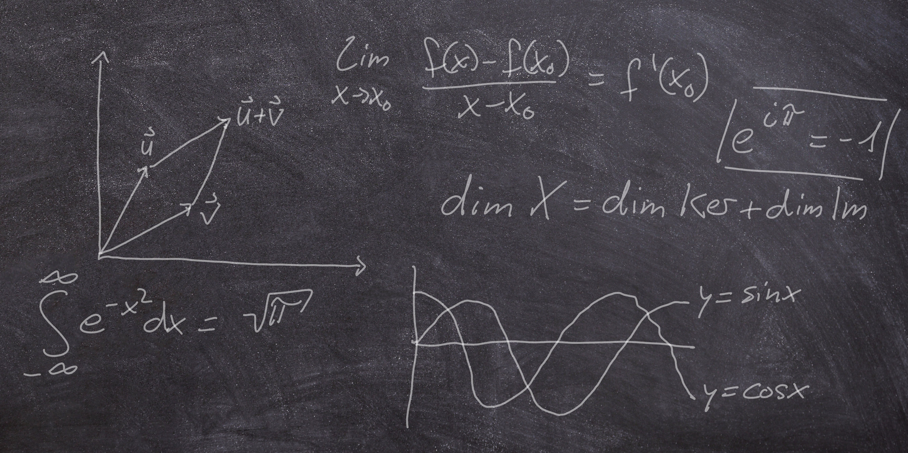

Von meinem dritten Bachelorsemester an der Universität Ulm an habe ich Tutorien für andere Bachelorstudierende in Mathematik- und Informatikstudiengängen gehalten und Übungsblätter korrigiert. Die zugehörigen Vorlesungen beschäftigten sich meistens mit Grundlagen der Mathematik wie Analysis und Lineare Algebra.

Meine beiden Semester an der Syracuse University wurden teilweise durch eine Teaching Assistantship finanziert, in deren Rahmen ich drei bis vier Tutorien pro Woche über Calculus II, III gehalten und beim Calculus Help Desk mitgeholfen habe.



In meiner Position als Doktorand und wissenschaftlicher Mitarbeiter an der Universität gehört zu meinen Aufgaben die Leitung des Übungsbetriebes von ein oder zwei Vorlesungen pro Semester in der Form von: 
- Erstellung wöchentlicher Aufgabenblätter und der Klausuren,
- Organisation von Tutorien und der Korrektur der Blätter,
- Vorstellen der Lösungen im Hörsaal.

Meine Lehrtätigkeit in der Regel für Veranstaltungen des Grundstudiums Mathematik der ersten vier Semester, so habe ich doch auch ein paar fortgeschrittenere Veranstaltung mitbetreut:

*	[Hyperbolic conservation laws](https://www.uni-ulm.de/en/ws20-1/hyperbolic-conservation-laws/) (gelesen von Prof. Dr. Emil Wiedemann)
*	[Elements of the calculus of variations](https://www.uni-ulm.de/en/mawi/iaa/lehre/ss-23/elements-of-calculus-of-variations/) (gelesen von Dr. Nicola Zamponi)
*	[Functional analysis (for data science)](https://www.uni-ulm.de/en/mawi/iaa/lehre/ws-23-24/functional-analysis/) (gelesen von Prof. Dr. Anna Dall’Acqua)

Für eine vollständige Übersicht der Veranstaltungen, die ich mitbetreut habe, verweise ich auf [meine Universitäts-Webseite](https://www.uni-ulm.de/mawi/iaa/members/raphael-wagner/).

Während der COVID-19 Pandemie habe ich meine Übungen im Hörsaal aufgezeichnet. Für einen ersten Eindruck meiner Lehre habe ich einen kleinen Abschnitt einer Übung hier hochgeladen (Analysis 1, Wintersemester 2020/2021).

_Problem: Zeigen Sie die folgende Aussagen mittels vollständiger Induktion.
Für jede natürliche Zahl $n\in\mathbb{N}$ ergibt die Summe der Quadrate der ersten $n$ natürlichen Zahlen $\frac{1}{6}n(n+1)(2n+1)$._

<video src="exercise_excerpt.mp4" controls="controls" style="max-width: 730px;">
</video>

