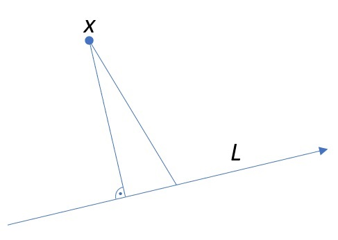
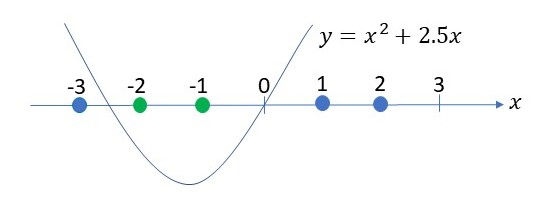
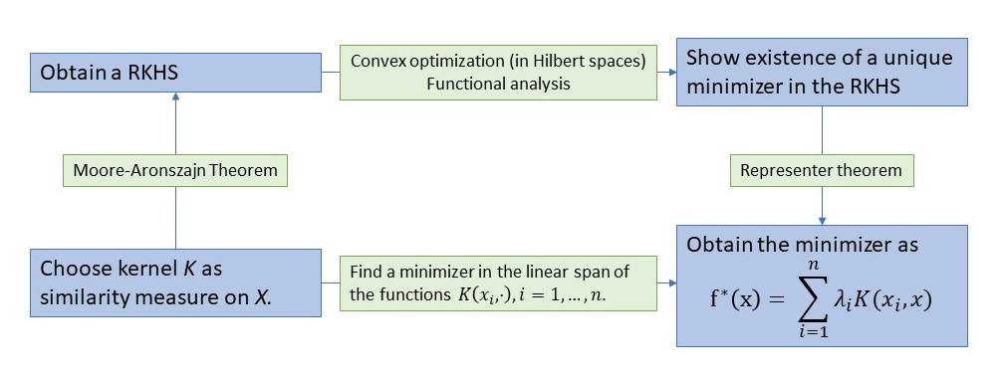
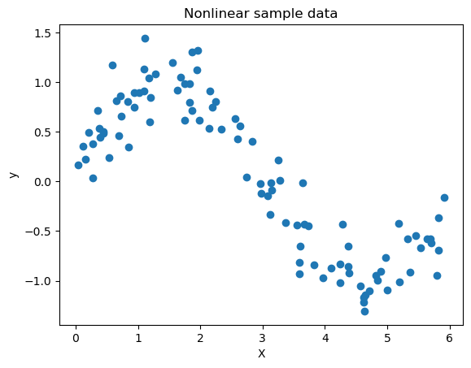
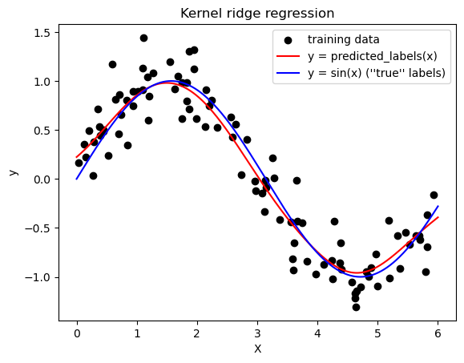

I first came across the subject of machine learning in a graduate level course on pattern recognition as part of my minor in computer science.\
The area focuses on the development of processes and algorithms which enable computers to learn a task from experience, driven by some performance measure. In particular, the way a task will be performed by a trained machine learning algorithm is not hard coded. In fact, for complex models such as deep neural networks, it appears to be difficult to extract patterns which the model has learned and by which it operates. 

By now, most academics I believe have heard or come across this subject of machine learning due to the broad spectrum of tasks for which there are machine learning methods available (supervised problems: classification, regression, ... and unsupervised problems: clustering and anomaly detection). Not to mention its vast success in different areas, e.g., detecting credit card fraud in bank statements or brain tumors in scans.\
Even in the numerical analysis of partial differential equations, machine learning algorithms are starting to establish themselves. In particular, in the earth sciences, where also a lot of data is collected, the simulation of models nowadays, by my understanding, is not only based on the numerical computation of the involved equations from physics, but is usually combined with data driven approaches. I was lucky to be able to attend talks at the mathematical colloquium at Ulm University given by [Prof. Dr. Jakob Runge](https://www.uni-ulm.de/fileadmin/website_uni_ulm/mawi.inst.010/Abstract_Jakob_Runge.pdf) and [Prof. Dr. Gitta Kutyniok](https://www.uni-ulm.de/fileadmin/website_uni_ulm/mawi.inst.010/Abstract_Kutyniok.pdf) who are experts in the area.

Nowadays, there is a ton of books and other resources available to teach machine learning methods to everyone with a very basic understanding of statistics and programming. Recently, I have been going through [Hands-On Machine Learning with Scikit-Learn, Keras, and TensorFlow](https://learning.oreilly.com/library/view/hands-on-machine-learning/9781098125967/) by Aurélien Géron, which I found to be very accessible. 

But even casting aside all the applications, many methods have a rather deep and interesting underlying mathematical foundation. The example that I recently came across is that of reproducing kernel Hilbert spaces (RKHS), which I thought I could shed some light on here. The nice part is that the theory of RKHS not only explains why methods such as ridge regression work and are reasonable, the theory also explains why the user does not need to understand its rather deep underlying theory to apply it, as it works in the background. 

RKHS play a role for certain regression and classification methods. 
Suppose we are given data which lies in some set $X$. Here, $X$ could be a set of text files, numerical data, images, etc. or combinations thereof. We suppose that each element in $X$ has a *true* class (classification), for instance when $X$ is the set of all dog or cat pictures and we have two classes, cats and dogs, or a *true* or *accurate* value, such as housing prizes, where $X$ could be the set of data of houses in an area. These classes or accurate values are usually called *labels*.

Suppose that we have input data $x_1, ... , x_n \in X$ for $n \in \mathbb{N}$ properties and we know the associated labels $y_1,...,y_n \in \mathbb{R}$. Then $(x_1,y_1),...,(x_n,y_n)$ is our training data.

We now wish to be able to be able to predict the label for any given input data $x \in X$. We express this by a function $f\colon X \to \mathbb{R}$, where we would hope that by choosing $f$ in a way that it is accurate on the training set, it will also be accurate on new data (the problem of overfitting will be a addressed in a moment).\
We measure accuracy by choosing a performance measure $V\colon X \times \mathbb{R} \to [0,\infty)$, where $V(f(x_i),y_i)$ should be small if $f(x_i) \sim y_i$ and large if $f(x_i)$ and $y_i$ deviate largely. A standard example for a performance measure is the square distance
$$ V(f(x_i),y_i) = |f(x_i) - y_i|^2.$$
Taking the mean over the training set, we obtain a loss-function for our regression function $f\colon X \to \mathbb{R}$:
$$ L(f) = \frac{1}{n}\sum_{i=1}^n V(f(x_i),y_i). $$
There are many valid choices for performance measures and loss functions. The main property that they usually all have in common is (strict) convexity. Under further assumptions, this leads mathematically to the existence of a unique minimum of the function and, at least in theory, to convergence of approximative schemes to this minimum.

Usually, by a fundamental study of the available training data, one has an a priori idea on how simple or complex the relationship between the input data $x \in X$ and the labels $y \in \mathbb{R}$ is and makes an a piori choice for one or several general models, e.g., linear or polynomials models, neural networks and so on. Therefore, instead of considering all functions $f\colon X \to \mathbb{R}$ as possible regression functions, we restrict ourselves to a subset of functions $H \subset \lbrace f\colon X \to \mathbb{R} \rbrace.$
The regression problem now lies in finding
$$ f^* := \underset{f \in H}{\operatorname{argmin}} L(f). $$

Minimization problems tend to be very convenient to handle in the setting of Hilbert spaces. Why? Hilbert spaces are certain vector spaces with an inner product. Such an inner product $\langle\cdot,\cdot\rangle_H$ gives us a notion of orthogonality, which is closely connected to the problem of minimizing distances. 



Therefore, we would like to have the Hilbert space structure for our set of functions $H$. This point of view is rather abstract as we view the functions in $H$ similarly to points for instance in the plane $\mathbb{R}^2$, where we have a *natural* notion of orthogonality. But this approach is at the core of [functional analysis](https://en.wikipedia.org/wiki/Functional_analysis), which during the past century has become one of the most powerful theories in mathematical analysis.

However, how can we achieve a meaningful notion of orthogonality between functions in $H$? This is usually not obvious at all. However, the theory of RKHS actually simplifies this question a ton by means of the [Moore-Aronszajn theorem](https://en.wikipedia.org/wiki/Reproducing_kernel_Hilbert_space#Moore%E2%80%93Aronszajn_theorem):
Suppose we have a kernel $K\colon X \times X \to \mathbb{R}$ which is 
- symmetric: K(z_1,z_2) = K(z_2,z_1) for all $z_1,z_2 \in X$ and
- positive semidefinite: for all $z_1,...z_k \in X$, $\lambda_1,...,\lambda_k \in \mathbb{R}$
$$ \sum_{i,j=1}^k \lambda_i\lambda_j K(z_i,z_j) \geq 0.$$
Then there exists a unique Hilbert space $H \subset \lbrace f \colon X \to \mathbb{R}\rbrace$, the *reproducing kernel Hilbert space* whose reproducing kernel is $K$, meaning that for every $f \in H$,
$$ f(x) = \langle K(x,\cdot), f \rangle_H.$$
Hence, one can choose a kernel with these properties and (in the background) automatically obtain a RKHS. Although it should be mentioned that the choice of an appropriate kernel may still be a delicate issue. In general, the symmetry and positive (semi-)definiteness of a kernel are properties it has in common with an inner product $ \langle \cdot, \cdot \rangle$. The inner product $\langle z_1,z_2 \rangle$ is the length of the orthogonal projection of $z_1$ onto the line spanned by $z_2$ (if $z_2$ is of unit length). Therefore, the closer $z_1$ and $z_2$ point in the same direction, the larger $\langle z_1,z_2 \rangle$ becomes. In other words, $\langle z_1,z_2 \rangle$ is a similarity measure between $z_1$ and $z_2$. Therefore, we likewise think of $K(z_1,z_2)$ as a similarity measure between $z_1,z_2 \in X$.


Common examples, if $X = \mathbb{R}^d$, are for instance
- the Gaussian kernel $K(z_1,z_2) = \exp\left( \frac{\|z_1-z_2\|^2}{\sigma^2} \right)$ for some $\sigma^2 > 0$,
- or polynomial kernels $K(z_1,z_2) = (z_1\cdot z_2 + 1)^l$ for some $l \in \mathbb{N}$.

If $X$ does not consist of numerical data in $\mathbb{R}^n$, one can first transform $X$ by use of feature maps $\varphi\colon X \to Y$. If $Y$ is a Hilbert space with inner product $\langle \cdot, \cdot \rangle$, then a kernel is given by 
$$K(z_1,z_2) = \langle \varphi(z_1),\varphi(z_2) \rangle_Y.$$
This method of constructing kernels by feature maps can also be used to embed non-linear regression or classification in a lower dimensional space to linear regression or classification in a higher dimensional space. Let us briefly review here one of the standard examples of this which is classification by quadratic polynomials: Suppose our data is simply one-dimensional $X \subset \mathbb{R}$ and we search for a quadratic regression function 
$$f \colon X \to \mathbb{R}, x \mapsto a x^2 + bx. $$
Using the feature map $\varphi \colon \mathbb{R} \to \mathbb{R}^2, x \mapsto (x,x^2)$, we hide the non-linear problem in the kernel $K$ given by the inner product on $\mathbb{R}^2$ and the feature map $\varphi$, i.e.,
$$K(z_1,z_2) = \langle \varphi(z_1),\varphi(z_2)\rangle_{\mathbb{R}^2} = \langle (z_1,z_1^2),(z_2,z_2^2)\rangle_{\mathbb{R}^2} = z_1z_2 + z_1^2z_2^2.$$
This is convenient as one can show that the quadratic functions on $\mathbb{R}$ correspond to functions in the associated RKHS (of linear functions on $\mathbb{R}^2$). This is an example of what is usually referred to as *kernel trick*.

Below, you can see an example of a set of 1-dimensional data $X = G \cup B$ with two different classes
$$G = \lbrace -1, -2 \rbrace \text{ and } B = \lbrace -3, 1, 2\rbrace,$$
which is not linearly, but quadratically separable in the sense that for $y = f(x) = x^2+2.5x$, we have $G = \lbrace x \in X : f(x) < 0\rbrace$ and $B = \lbrace x \in X : f(x) \geq 0\rbrace$.



The feature map transforms the data into points in the plane $\mathbb{R}^2$.


There, the data is linearly separable, i.e., if we let 
$$\tilde{G} = \lbrace (-1,1), (-2,4) \rbrace \text{ and } \tilde{B} = \lbrace (-3,9), (1,1), (2,4)\rbrace,$$
and $\tilde{f}(x,y) = y+2.5x$, then $\tilde{G} = \lbrace (x,y) = \varphi(x) : x \in X \text{ and } \tilde{f}(x,y) < 0\rbrace$, while $\tilde{B} = \lbrace (x,y) = \varphi(x) : x \in X \text{ and } \tilde{f}(x,y) \geq 0\rbrace$.
Moreover, let us note that we can actually represent $f$ as a linear combination of the kernel functions $K(-3,\cdot), K(-2,\cdot), K(-1,\cdot), K(1,\cdot), K(2,\cdot)$ evaluated at the data in $X$. Indeed,
$$f(x) = \frac{7}{4} K(1,x) - \frac{3}{4}K(-1,x).$$
This is not a mere coincident and we will come back to later.

Finally, I would like to stress again that the Moore-Aronszajn theorem is by no means trivial and understanding its proof does indeed require a solid foundation in functional analysis.

Comming back to the regression problem in the RKHS, let us also point here towards the issue of overfitting the data, which may happen if we fit a model that is very complex relative to  the actual data, whereby the model may become overly sensitive to noise.\
In our setting of RKHS, this may prevented by Tikhonov regularization, meaning we add to our loss function a regularization term so that
$$ L(f) = \frac{1}{n}\sum_{i=1}^n V(f(x_i),y_i) + c \|f\|_H^2,$$
where $c > 0$ is a regularization parameter and $\|f\|_H = \sqrt{\langle f,f\rangle_H}$ is the norm of $f$ given by the inner product on $H$. This is indeed a regularization because any $f \in H$ is Lipschitz continuous with Lipschitz constant $\|f\|_H$:
\begin{align*}
|f(x_1) - f(x_2)| = |\langle f,K(x_1,\cdot)-K(x_2,\cdot)\rangle| \leq  \|f\|_H d(x,y),
\end{align*}
where $d(x_1,x_2) := \|K(x_1,\cdot)-K(x_2,\cdot)\|_H$ can in fact be thought of as distance on $X$ between $x_1$ and $x_2$. This Lipschitz continuity means that the slope of $f$ is bounded by $\|f\|_H$. Therefore, by adding this quantity into our loss functional that we are trying to minimize, we are preventing overfitting behavior. This is iluustrated in the figure below of given training data. The relationship between the data points $x$ and their labels $y$ appears to be rather linear. However, the orange curve fits the data exact, whereas the linear green curve has a non-zero loss. To make the perfect fit happen, note that the orange curve needs to have a relatively large slope at certain points. By including the regularization term, a regression algorithm with this loss function is therefore more prone to result in a rather linear model.


Now, in general, it can be hard or almost impossible to determine the RKHS associated to a kernel $K$. Therefore, even if the setting of RKHS allows us to theoretically derive the existence of an optimal solution $f^* \in H$ to the regression problem, what good is it in practice if we have no idea what $f^*$ or even $H$ looks like?
Again, the abstract theory of RKHS helps us out by means of the [representer theorem](https://en.wikipedia.org/wiki/Representer_theorem), which states:

In the situation above with training data $(x_i,y_i), i = 1,...,n$, the optimal solution is given by
$$ f^*(x) = \sum_{i=1}^n \lambda_i K(x_i,x) $$
for some coefficients $\lambda_1,...,\lambda_n \in \mathbb{R}^n$. 

Hence, we only need to search for the minimum in the class of linear combinations of the functions $x \mapsto K(x_1,x),...,K(x_n,x)$ which essentially boils down to linear regression in $\mathbb{R}^n$.


To summarize this, let us have a look at the figure below. The diagram below commutes so to speak, meaning that instead of going the way around the abstract theory to arrive at a minimizer for our loss function, it actually suffices to perform linear regression in $\mathbb{R}^n$ to obtain optimal coefficients $\lambda_1, ... ,\lambda_n \in \mathbb{R}$ w.r.t. to the loss functions for the function $f^*(x) = \sum_{i=1}^n \lambda_i K(x_i,x)$.
This is usually called ridge regression



In the following, I included a small example of ridge regression in the form of a Jupyter Notebook, displaying that it may detect non-linear patterns in data while simultaneously not being overly sensitive to noise. Here, I used the already implemented methods from scikit-learn.

```python
import numpy as np
import matplotlib.pyplot as plt
from sklearn.kernel_ridge import KernelRidge
from sklearn.model_selection import GridSearchCV

np.random.seed(42)

num_samples = 100

# generate the independent variable (x) as a random sample from a uniform distribution
X = np.random.uniform(low=0.0, high=6, size=num_samples)

# generate the dependent variable (y) as sin(x) with some gaussian noise
noise = np.random.normal(scale=0.25, size=num_samples)
y = np.sin(X).ravel() + noise

X = X.reshape(-1, 1)
y = y.reshape(-1, 1)

# plot sample data
plt.scatter(X, y)
plt.xlabel('X')
plt.ylabel('y')
plt.title('Nonlinear sample data')
plt.show()   
```


    

    


```python
# Fit a ridge regression model with gaussian kernel
# Use grid-search cross-validation to find good parameter combinations alpha (regularization) and gamma = 1/sigma

kr_cv = GridSearchCV(
    KernelRidge(kernel="rbf", gamma=0.1),    
    param_grid={"alpha": [1e0, 0.1, 1e-2, 1e-3], "gamma": np.linspace(1, 100, 10)},
)
kr_cv.fit(X, y)

X_plot = np.linspace(0, 6, 1000)[:, None]

plt.scatter(X, y, c='k', label="training data")
plt.plot(X_plot, kr_cv.predict(X_plot), c='r', label="y = predicted_labels(x)")
plt.plot(X_plot, np.sin(X_plot).ravel(), c='b', label="y = sin(x) (''true'' labels)")

plt.xlabel("X")
plt.ylabel("y")
plt.title("Kernel ridge regression")
plt.legend()
```


    <matplotlib.legend.Legend at 0x238f07d75e0>


    

    

As we can see our regression model picked up the non-linear pattern without getting too distracted by the noise. 

