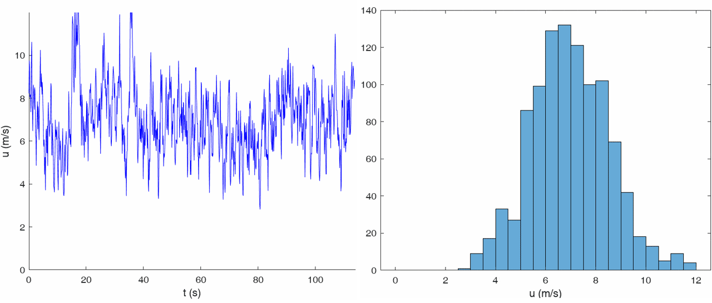
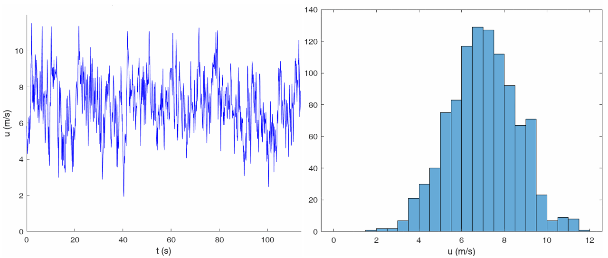
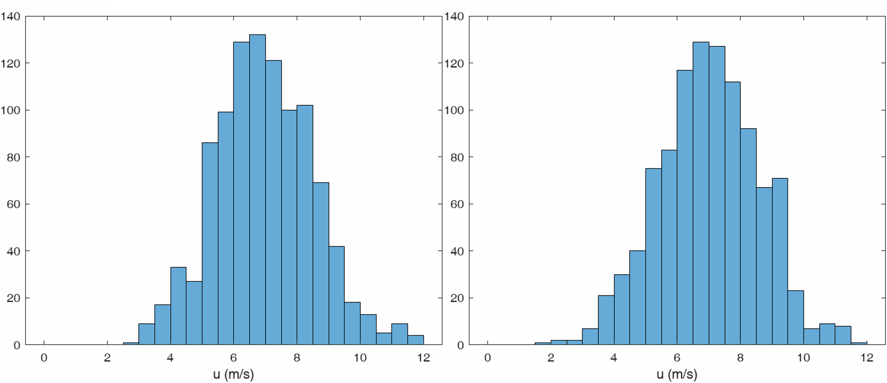

In my research, I study statistical notions of solutions for certain equations in mathematical fluids mechanics. While the development of this theory tends to be quite abstract, some motivation comes from studying and experimenting with turbulent flows. Indeed, it is a longstanding and widely accepted view in turbulence theory that turbulent flows are more accurately described by probabilistic and statistical models than by purely deterministic considerations. Indeed, one of the fundamental aspects of a turbulence flow is the difficulty in the precise prediction of its behavior.\
Therefore, in the applied sciences, models of turbulent flows typically have a stochastic component and consider averages of the quantities in the governing mathematical equations.\
Below you can see two signals using the same parameters, produced by a Matlab implementation by E. Cheynet[^1] of the [von Kármán wind turbulence model](https://en.wikipedia.org/wiki/Von_K%C3%A1rm%C3%A1n_wind_turbulence_model), which is based on the Reynolds-averaged Navier-Stokes (RANS) equations. This model has proven to provide a fairly accurate basis for the description of wind turbulence. 

If we consider the final histograms below, we note that both look somewhat similar. Of course, our sample is very small and we only repeated the simulation twice. More importantly, I have to admit that the model and its simulation already includes some randomness, whereby this result is not very surprising. However, this behavior is also observed in real measurement data from wind tunnels, see for instance U. Frisch[^2].

Alternative and probabilistic approaches to the models and equations from fluid mechanics also stem from the fact that existence of a unique, physically relevant solution for these equations is often unknown. In fact, one the 1 Mio. $ prize [Millenium prize problems](https://www.claymath.org/millennium-problems/) focuses around this issue.

In the following section, I will describe a little bit more in depth what my research area is about and what problems I considered in my articles and preprints.

In my research, I primarily consider the incompressible Euler 
$$
\begin{equation}
\begin{split}
\partial_t u + (u\cdot\nabla)u + \nabla p + \gamma u &=  f,\\
\operatorname{div} u &= 0,
\end{split}
\end{equation}
$$
and Navier-Stokes equations
$$
\begin{equation}
\begin{split}
\partial_t u + (u\cdot\nabla)u + \nabla p + \gamma u - \nu\Delta u &=  f,\\
\operatorname{div} u &= 0,
\end{split}
\end{equation}
$$
formulated here in velocity $u \colon (0,T) \times \Omega \to \mathbb{R}^d$ with pressure $p\colon (0,T) \times \Omega \to \mathbb{R}$, an external force $f\colon (0,T) \times \Omega \to \mathbb{R}^d$ and kinematic viscosity $\nu > 0$ on a domain $\Omega \subset \mathbb{R}^d$ until some time $T > 0$.
Both equations are fundamental equations in fluid mechanics, yet mathematically, many standard questions in the theory of partial differential equations such as *existence*, *uniqueness*, and *regularity* are still open. Let me first explain what these properties mean and then point out a small selection of the currently open issues related to these.

* Existence: For any initial state of the fluid and other fixed parameters such as boundary data, we would like there to exist a solution to these fluid equations which describes the fluid at any later time. After all, we describe a physical problem and would expect such solutions to exist.\
Existence of (weak) solutions for the 3D Navier-Stokes equations has been known since the work of Leray in 1934. For the 2D Euler equations, many general existence results for weak solutions have been obtained in the past 15 years using the [convex integration](https://annals.math.princeton.edu/2009/170-3/p09) machinery by De Lellis and Székelyhidi Jr. 
* Uniqueness: Ideally, such a solution to these equations should also be unique. After all, if all the data is fixed, we would intuitively expect that the behavior of the fluid is deterministic, rather than having to deal with the possibility of the fluid behaving (at random) in different ways.\
Just in the past year, however, [Albritton, Brué and Colombo](https://projecteuclid.org/journals/annals-of-mathematics/volume-196/issue-1/Non-uniqueness-of-Leray-solutions-of-the-forced-Navier-Stokes/10.4007/annals.2022.196.1.3.full) proved that for a certain external force $f$, the Leray-solutions are in fact non-unique. Moreover, the convex integration solutions for the 2D Euler equations are vastly non-unique, in fact, this technique yields infinitely many solutions for any given initial state. To resolve this issue, it is an ongoing task to find further conditions, which single out *physical* solutions.
* Regularity means that in a certain way, if the data has nice properties, which correspond to real physical fluids, then the solutions at least maintain that regularity.\
In constrast to the previously mentioned weak solution, regular solutions are unique. However, it is generally unknown if regular initial data yields regular solutions globally in time for the 3D Navier-Stokes equations. If this was false, it would mean that a nice initial state of the fluid could in time develop singularities, meaning that the fluid has infinite velocity at certain points in space in time. While physically, this is impossible, precise mathematical analysis of the Navier-Stokes equations has still not ruled this out. This is in fact one the [Millenium prize problems](https://www.claymath.org/millennium-problems/) by the Clay Mathematics Institute, deemed to be one of the most important open mathematical problems with a $1 Million prize. The problem is likewise open for the 3D Euler equations. 

The Euler equations or Navier-Stokes equations with very small viscosity $\nu > 0$ (or high Reynolds number) are generally associated to turbulent fluid flows as this translates to fluid particles being able to move more independently from one another.\
In contrast to our description above of uniqueness, one aspect of turbulent fluids is their unpredictable behavior, whereby it may be unreasonable to expect unique solutions. Rather, one should allow for the possibility of the system potentially evolving in different ways.\
This is not too bad since at least experimentally, it is widely accepted that certain statistical properties of turbulent fluids are in fact reproducible, whereby a probabilistic or statistical solution concept may be accurate and more natural.\
One approach would be to assume that the system is in fact described by a deterministic component plus some noise, which leads to a model based on stochastic differential equations.\
Somewhat differently, rather than trying to describe single, individual solutions, another approach is to describe a whole ensemble of solutions or possible states of the system by a probability distribution on an appropriate phase space. Then, one studies the evolution in time of these distributions. This latter approach can somewhat loosely be found in work by Hopf in 1950 and in a precise framework from [1972](http://www.numdam.org/item/RSMUP_1972__48__219_0.pdf) and [1973](http://www.numdam.org/item/RSMUP_1973__49__9_0.pdf) by Foias and in [1978](https://link.springer.com/article/10.1007/BF00973601) by Vishik and Fursikov for the 3D Navier-Stokes equations.\
Based on further study of these statistical solutions of the Navier-Stokes equations, the main subject of my doctoral studies involved the development of analogous notions of statistical solutions for the 2D Euler equations. 
* [Wagner, R.,Wiedemann, E.: Statistical solutions of the two-dimensional incompressible
Euler equations in spaces of unbounded vorticity. J. Funct. Anal. 284(4), 109777 (2023)](https://www.sciencedirect.com/science/article/abs/pii/S0022123622003974?via%3Dihub)\
My first published article, written together with my advisor Prof. Dr. Emil Wiedemann, shows existence of statistical solutions of the 2D Euler equations under certain assumptions on the vorticity for various notions of statistical solutions.
* [Gallenmüller, D., Wagner, R. & Wiedemann, E. Probabilistic Descriptions of Fluid
Flow: A Survey. J. Math. Fluid Mech. 25, 52 (2023)](https://link.springer.com/article/10.1007/s00021-023-00800-z)\
My second published article, written with my advisor Prof. Dr. Emil Wiedemann and former post-doctoral researcher Dr. Dennis Gallenmüller at the Institute of Applied Analysis, discusses connections between different notions of statistical solutions, some of their relations to other concepts such as so-called measure-valued solutions, presents general strategies to show their existence and briefly discusses some open problems.
* [R. Wagner, Vanishing of long time average p-enstrophy dissipation rate in the inviscid
limit of the 2D damped Navier-Stokes equations, arXiv preprint, 2023](https://arxiv.org/abs/2306.05081)\
My final article, which is currently under review for publication, generalizes and simplifies an earlier result from 2007 by Constantin and Ramos for the vanishing of long-time averages of enstrophy dissipation rate in the vanishing viscosity limit. Enstrophy is the integral of the square of the vorticity in space, thereby representing in a certain sense globally how rotational a fluid is. Note that above, the Euler and Navier-Stokes equations only differ by the viscous term $\nu\Delta u$. Viscosity generally leads to dissipation of enstrophy in time. However, what happens when one considers smaller and smaller viscosity $\nu \to 0$ ? Does the enstrophy dissipation rate also vanish? This is an important question in the Batchelor-Kraichnan theory for 2D turbulence. If there remains some kind of dissipation in the system, this is usually refereed to as anomalous (enstrophy)-dissipation.\
Likewise to Constantin and Ramos, my article first considers long-time averages of the system to obtain a sort of stationary state and then considers the vanishing viscosity scenario, where indeed the viscous enstrophy dissipation rate vanishes as $\nu \to 0$. The preprint utilizes some nice ideas from ergodic and dynamical system theory as well as some recent results on the vanishing viscosity limit.

[^1]: Cheynet, E. Wind Field Simulation (the Fast Version). Zenodo, 2020, doi:10.5281/ZENODO.3774136
[^2]: Frisch, U. Turbulence: The Legacy of A. N. Kolmogorov. Cambridge: Cambridge University Press; 1995. doi:10.1017/CBO9781139170666