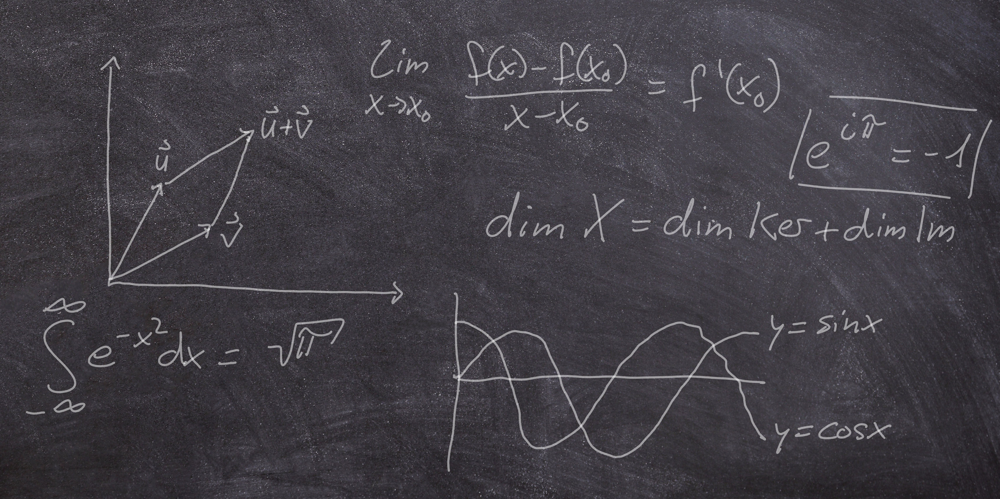

From my third semester as a student at Ulm University on, I was tutoring and grading undergraduate students in math and computer science programmes. The classes mostly involved the fundamentals of mathematics such as analysis and linear algebra.

My stay at Syracuse University as a graduate student was partially funded by a teaching assistantship, where I was giving three to four recitations each week for calculus classes and helped students at the weekly calculus help desk. 



In my position as a doctoral candidate and scientific assistant at Ulm University, my duties involve creating weekly assignment sheets as well as the final exams, administering the grading thereof and presenting the solutions in an auditorium.

The corresponding classes were mostly on the fundamentals of mathematics. Some more advanced courses for which I organized the exercises include the subjects of

*	[Hyperbolic conservation laws](https://www.uni-ulm.de/en/ws20-1/hyperbolic-conservation-laws/) (taught by Prof. Dr. Emil Wiedemann)
*	[Elements of the calculus of variations](https://www.uni-ulm.de/en/mawi/iaa/lehre/ss-23/elements-of-calculus-of-variations/) (taught by Dr. Nicola Zamponi)
*	[Functional analysis (for data science)](https://www.uni-ulm.de/en/mawi/iaa/lehre/ws-23-24/functional-analysis/) (taught by Prof. Dr. Anna Dall’Acqua)

For a complete overview of the classes I taught in the past years, see [my university profile](https://www.uni-ulm.de/en/mawi/iaa/members/raphael-wagner/).

During the COVID-19 pandemic, I recorded my exercise sessions. If you would like to get a first impression of me teaching in the classroom, have a look at an excerpt of one the sessions I recorded back then (Analysis 1, winter semester 2020/2021, in German).

_Problem: Zeigen Sie die folgende Aussage mittels vollständiger Induktion.\
Für jede natürliche Zahl $n\in\mathbb{N}$ ergibt die Summe der Quadrate der ersten $n$ natürlichen Zahlen $\frac{1}{6}n(n+1)(2n+1)$._

<video src="exercise_excerpt.mp4" controls="controls" style="max-width: 730px;">
</video>

